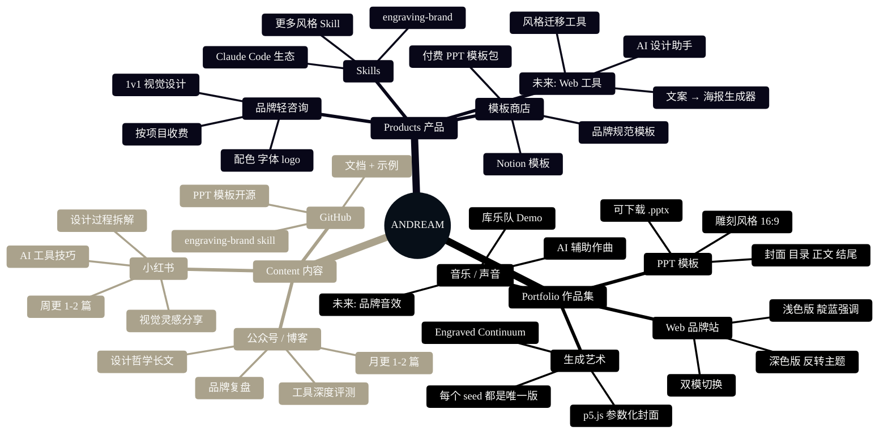
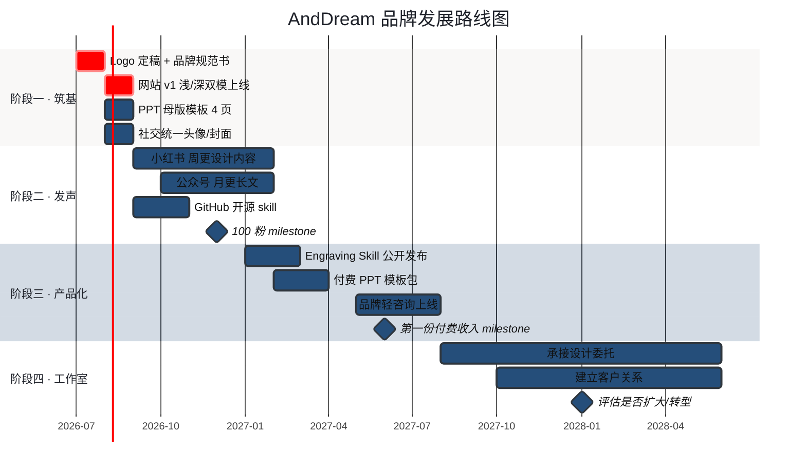
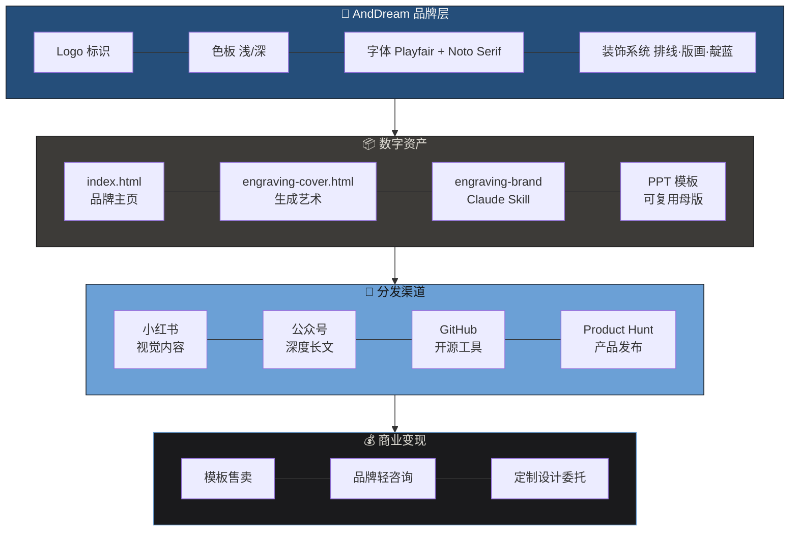

# AndDream 品牌架构

```mermaid
---
config:
  theme: base
  themeVariables:
    primaryColor: "#254E7A"
    primaryTextColor: "#FAFAF8"
    secondaryColor: "#3D3B38"
    tertiaryColor: "#E0DDD5"
    lineColor: "#6BA0D6"
    fontFamily: "Lora, serif"
---
mindmap
  root((ANDREAM))
    Portfolio 作品集
      Web 品牌站
        浅色版 靛蓝强调
        深色版 反转主题
        双模切换
      PPT 模板
        雕刻风格 16:9
        封面 目录 正文 结尾
        可下载 .pptx
      生成艺术
        Engraved Continuum
        p5.js 参数化封面
        每个 seed 都是唯一版
      音乐 / 声音
        AI 辅助作曲
        库乐队 Demo
        未来: 品牌音效

    Content 内容
      小红书
        设计过程拆解
        AI 工具技巧
        视觉灵感分享
        周更 1-2 篇
      公众号 / 博客
        设计哲学长文
        品牌复盘
        工具深度评测
        月更 1-2 篇
      GitHub
        engraving-brand skill
        PPT 模板开源
        文档 + 示例

    Products 产品
      Skills
        engraving-brand
        更多风格 Skill
        Claude Code 生态
      模板商店
        付费 PPT 模板包
        品牌规范模板
        Notion 模板
      品牌轻咨询
        1v1 视觉设计
        配色 字体 logo
        按项目收费
      未来: Web 工具
        文案 → 海报生成器
        风格迁移工具
        AI 设计助手
```

# 发展路线图

```mermaid
---
config:
  theme: base
  themeVariables:
    primaryColor: "#254E7A"
    primaryTextColor: "#FAFAF8"
    secondaryColor: "#1A1A1C"
    tertiaryColor: "#E0DDD5"
    textColor: "#111111"
    todayColor: "#6BA0D6"
---
gantt
    title AndDream 品牌发展路线图
    dateFormat  YYYY-MM
    axisFormat  %Y-%m
    tickInterval 3month

    section 阶段一 · 筑基
    Logo 定稿 + 品牌规范书   :crit, a1, 2026-07, 2026-08
    网站 v1 浅/深双模上线    :crit, a2, after a1, 2026-09
    PPT 母版模板 4 页        :a3, 2026-08, 2026-09
    社交统一头像/封面         :a4, 2026-08, 2026-09

    section 阶段二 · 发声
    小红书 周更设计内容       :b1, 2026-09, 2027-02
    公众号 月更长文           :b2, 2026-10, 2027-02
    GitHub 开源 skill          :b3, 2026-09, 2026-11
    100 粉 milestone          :milestone, b4, 2026-12, 0d

    section 阶段三 · 产品化
    Engraving Skill 公开发布   :c1, 2027-01, 2027-03
    付费 PPT 模板包            :c2, 2027-02, 2027-04
    品牌轻咨询上线             :c3, 2027-05, 2027-08
    第一份付费收入 milestone  :milestone, c4, 2027-06, 0d

    section 阶段四 · 工作室
    承接设计委托               :d1, 2027-08, 2028-06
    建立客户关系               :d2, 2027-10, 2028-06
    评估是否扩大/转型          :milestone, d3, 2028-01, 0d
```

# 技术架构

```mermaid
flowchart TB
    subgraph 品牌层["🎨 AndDream 品牌层"]
        direction LR
        B1[Logo 标识] --- B2[色板 浅/深]
        B2 --- B3[字体 Playfair + Noto Serif]
        B3 --- B4[装饰系统 排线·版画·靛蓝]
    end

    subgraph 资产层["📦 数字资产"]
        direction LR
        A1[index.html<br/>品牌主页] --- A2[engraving-cover.html<br/>生成艺术]
        A2 --- A3[engraving-brand<br/>Claude Skill]
        A3 --- A4[PPT 模板<br/>可复用母版]
    end

    subgraph 渠道层["📡 分发渠道"]
        direction LR
        C1[小红书<br/>视觉内容] --- C2[公众号<br/>深度长文]
        C2 --- C3[GitHub<br/>开源工具]
        C3 --- C4[Product Hunt<br/>产品发布]
    end

    subgraph 创收层["💰 商业变现"]
        direction LR
        R1[模板售卖] --- R2[品牌轻咨询]
        R2 --- R3[定制设计委托]
    end

    品牌层 --> 资产层 --> 渠道层 --> 创收层

    style 品牌层 fill:#254E7A,color:#FAFAF8,stroke:#1A1A1C
    style 资产层 fill:#3D3B38,color:#E0DDD5,stroke:#1A1A1C
    style 渠道层 fill:#6BA0D6,color:#111,stroke:#1A1A1C
    style 创收层 fill:#1A1A1C,color:#E0DDD5,stroke:#6BA0D6
```
